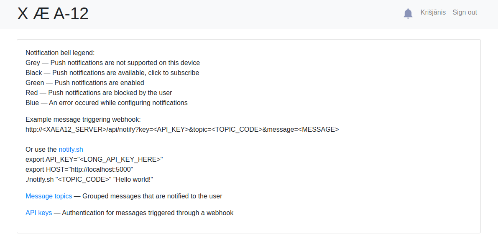
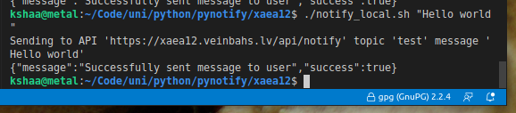
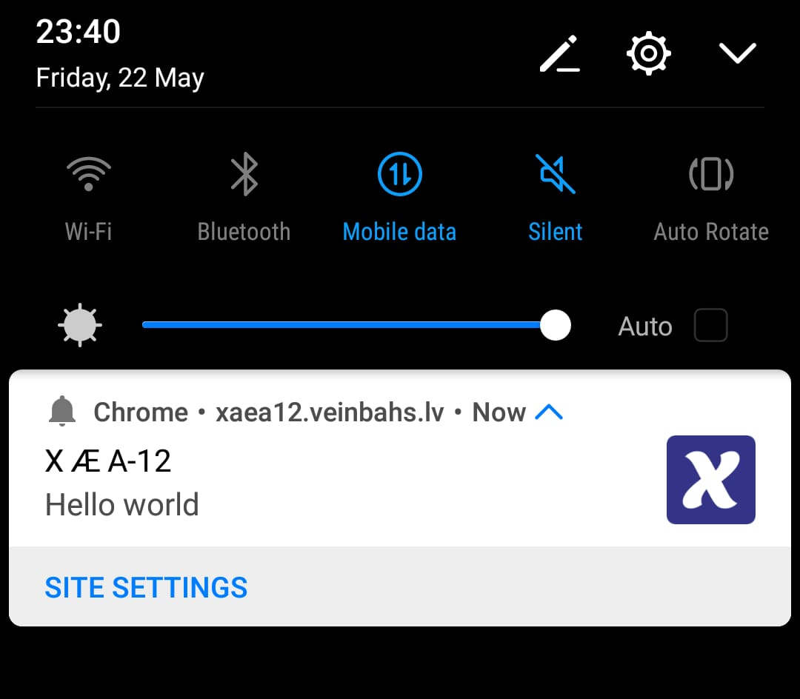

# X Æ A-12
Flask web app for sending push notifications using a web-hook  

Bootstrapped using [the Flask-User-Starter-App](https://github.com/lingthio/Flask-User-starter-app/)  
Push notifications sourced from [Push Notifications codelab](https://github.com/GoogleChrome/push-notifications)  

## Environment
Developed on python 3.6.9, other versions might also work  
Install dependencies using `pip install -r requirements.txt`  
Configure `app/local_settings.py` using `app/local_settings_example.py` as a template
Or use environment variables as per `app/settings.py` and use [Python environs library](https://pypi.org/project/environs/) as reference.  
Initialize the database with migrations using `flask db upgrade`  
Or in case of docker composition configure `.env` using `.env.sample` as a template

## Server usage
Start the Flask development web server using `python3 manage.py runserver`  
Or use the docker composition and start using `docker-compose up -d`  

## Client usage
Suppose the host is `http://localhost:5000/` (used later as `HOST`)  
Open `http://localhost:5000/`  

Example user story:  
- Register
- Confirm email
- Login
- Subscribe to push notifications using bell icon
- Create message topic (used later as `TOPIC_CODE`)
- Create API key (used later as `API_KEY`)
- Send messages using CLI using `notify.sh`

```bash
export API_KEY="<LONG_API_KEY_HERE>"
export HOST="http://localhost:5000"

./notify.sh "<TOPIC_CODE>" "Hello world!"
```

## Illustrations for client usage
#### Homepage
Create a topic and API key here  
  

#### CLI
Configure `notify_local_example.sh` with your API key & topic code and send your message  
  

#### Desktop notification


#### Mobile notification
  